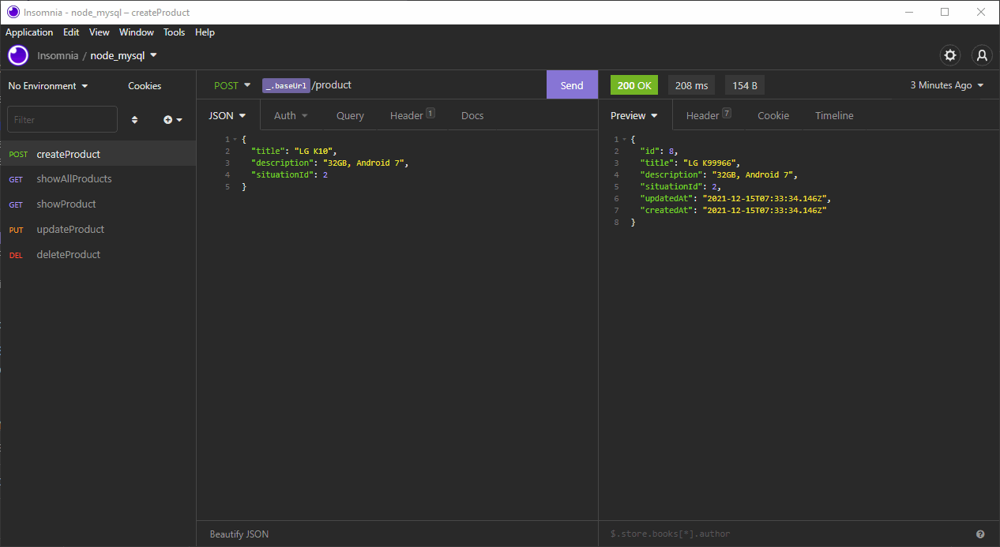

<h1 align="center">Node API with MySQL</h1>

 

  <a href="#rocket-technologies">Technologies</a>&nbsp;&nbsp;&nbsp;|&nbsp;&nbsp;&nbsp;
   <a href="#-project">Project</a>&nbsp;&nbsp;&nbsp;|&nbsp;&nbsp;&nbsp;
  <a href="##electric_plug-getting-started">Getting started</a>

 

<h2>Project working:<h2>

    

## :rocket: Technologies

In this project we used `Node.js` to build a Rest API using `Express`, `Nodemon`, `Sequelize` and the `MySQL` database.

## 💻 Project

This is a study project on how to develop an API in Node.js with Sequelize, Express and MySQL :books:

## :electric_plug: Getting started

1. Clone this repository using: `git@github.com:Henry001-prog/node-api-mysql.git`
2. Enter in the project directory: `cd node-api-mysql`
3. Install all dependencies running in terminal: `yarn`
6. Run `yarn start` in another terminal or in the terminal of the code editor you use to run the project